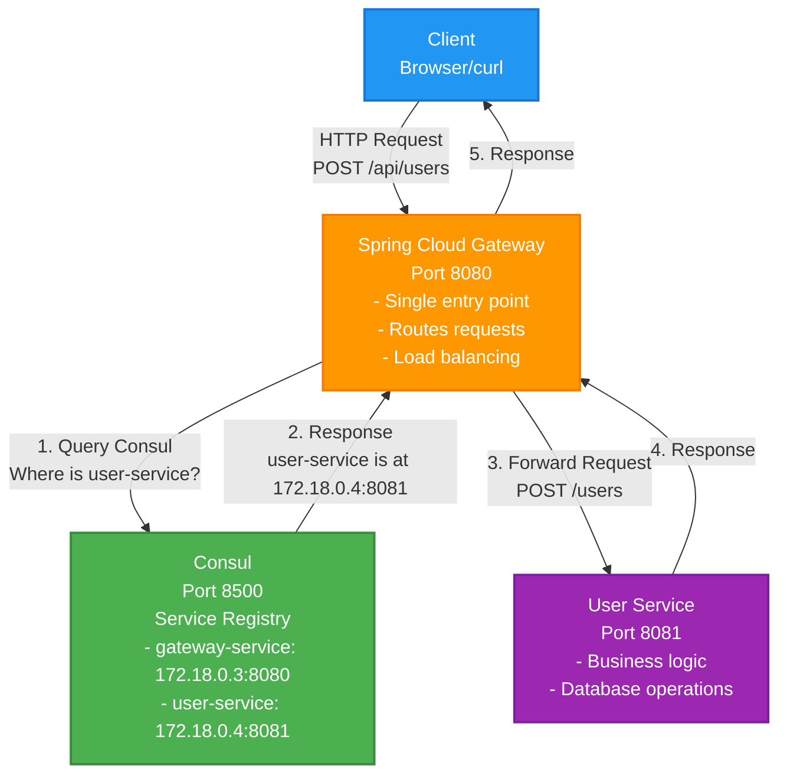
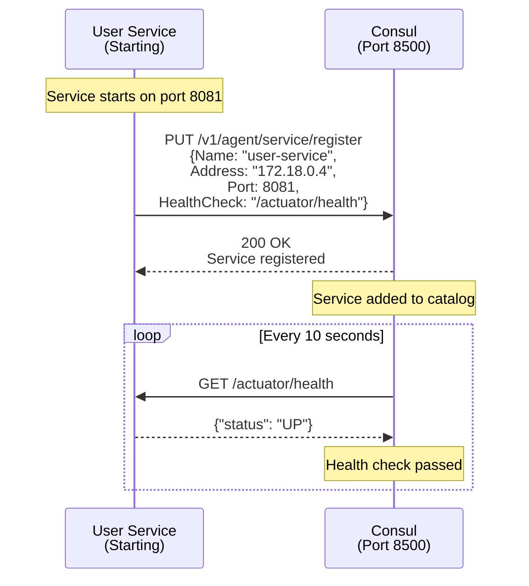
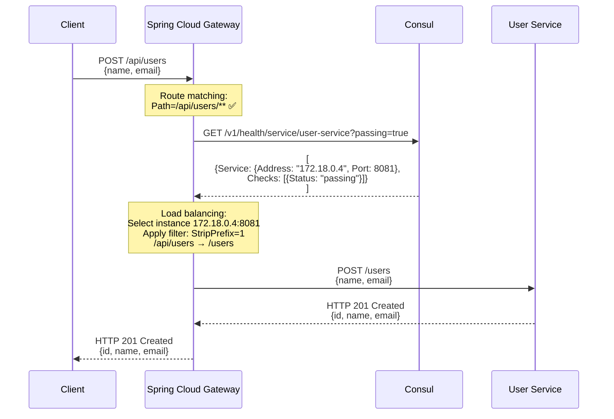
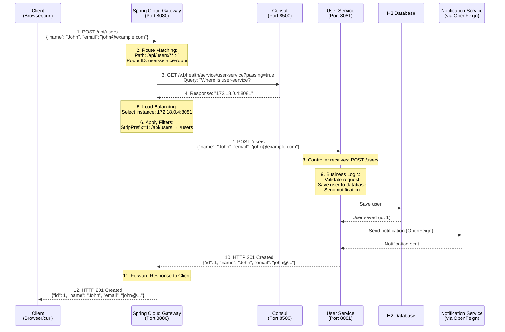
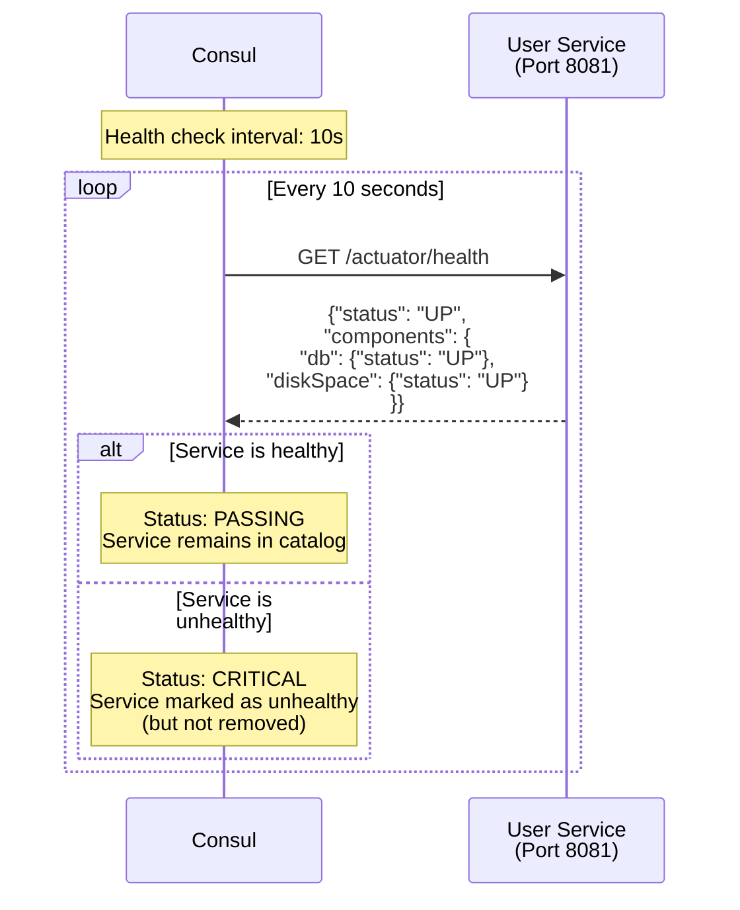
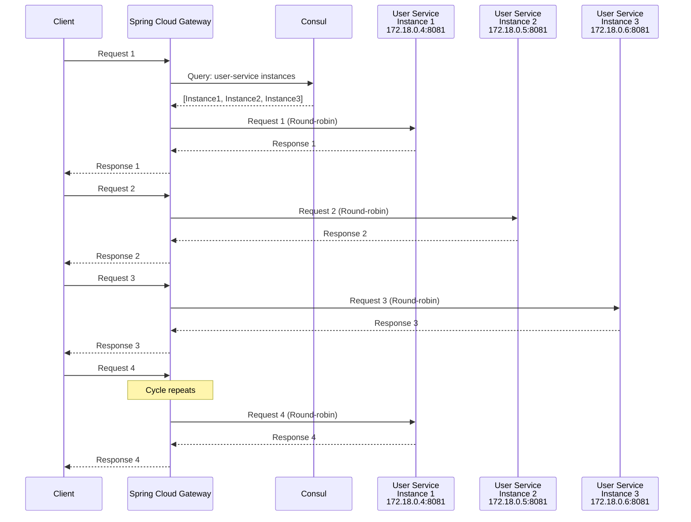
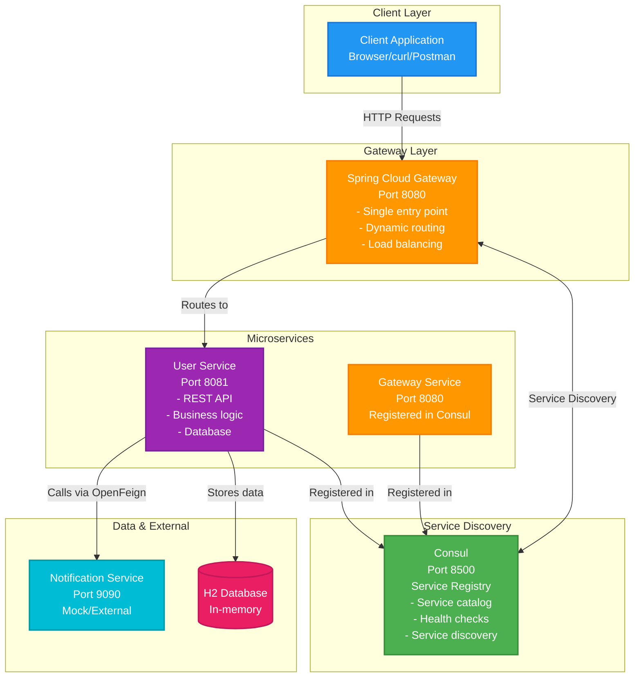

# How It Works: Consul Service Discovery & Spring Cloud Gateway

This document explains how Consul Service Discovery and Spring Cloud Gateway work together in this project.

## Table of Contents

- [Overview](#overview)
- [What is Consul?](#what-is-consul)
- [What is Spring Cloud Gateway?](#what-is-spring-cloud-gateway)
- [Service Registration Process](#service-registration-process)
- [Service Discovery Process](#service-discovery-process)
- [Complete Request Flow](#complete-request-flow)
- [Health Checks](#health-checks)
- [Load Balancing](#load-balancing)
- [Configuration Details](#configuration-details)
- [Verification Steps](#verification-steps)

---

## Overview

In a microservices architecture, services need to:
1. **Register themselves** so other services can find them
2. **Discover other services** to communicate with them
3. **Route requests** through a single entry point (Gateway)

This project uses:
- **Consul**: Service registry and discovery
- **Spring Cloud Gateway**: API Gateway with dynamic routing

### Architecture Overview



---

## What is Consul?

**Consul** is a service mesh solution that provides:
- **Service Discovery**: Services register themselves and discover others
- **Health Checking**: Monitors service health
- **Key/Value Store**: Configuration storage
- **Multi-Datacenter**: Supports distributed deployments

### How Consul Works

1. **Service Registration**: When a service starts, it registers itself with Consul
2. **Service Discovery**: Services query Consul to find other services
3. **Health Checks**: Consul periodically checks if services are healthy
4. **Service Catalog**: Consul maintains a catalog of all registered services

### Consul in This Project

```yaml
# docker-compose.yml
consul:
  image: hashicorp/consul:1.17
  ports:
    - "8500:8500"
  command: agent -server -ui -bootstrap-expect=1 -client=0.0.0.0
```

- **Port 8500**: HTTP API and UI
- **UI**: Accessible at http://localhost:8500
- **Agent Mode**: Server mode (can be clustered, but single node for demo)

---

## What is Spring Cloud Gateway?

**Spring Cloud Gateway** is an API Gateway built on Spring WebFlux that provides:
- **Dynamic Routing**: Routes requests to backend services
- **Load Balancing**: Distributes load across service instances
- **Service Discovery Integration**: Works with Consul, Eureka, etc.
- **Filters**: Request/response transformation
- **Circuit Breaker**: Resilience patterns

### Gateway Configuration

```yaml
# gateway-service/src/main/resources/application.yml
spring:
  cloud:
    gateway:
      discovery:
        locator:
          enabled: true  # Enable Consul service discovery
      routes:
        - id: user-service-route
          uri: lb://user-service  # 'lb://' = load-balanced via Consul
          predicates:
            - Path=/api/users/**
          filters:
            - StripPrefix=1  # Remove /api/users, forward /users/**
```

**Key Components:**
- **`lb://user-service`**: Load-balanced URI via Consul discovery
- **Predicates**: Conditions for routing (e.g., path matching)
- **Filters**: Request/response transformations (e.g., strip prefix)

---

## Service Registration Process

When a service starts, it automatically registers itself with Consul.

### Registration Flow



### Step-by-Step Registration

#### 1. Service Starts

```bash
# User Service starts on port 8081
docker compose up user-service
```

#### 2. Spring Cloud Consul Client Initializes

```yaml
# user-service/src/main/resources/application.yml
spring:
  application:
    name: user-service
  cloud:
    consul:
      host: consul  # Consul hostname in Docker network
      port: 8500
      discovery:
        service-name: ${spring.application.name}  # "user-service"
        health-check-path: /actuator/health
        health-check-interval: 10s
        register: true  # Enable registration
        prefer-ip-address: true
```

#### 3. Registration Request to Consul

Spring Cloud Consul sends a registration request:

```http
PUT http://consul:8500/v1/agent/service/register
{
  "ID": "user-service-8081",
  "Name": "user-service",
  "Address": "172.18.0.4",  # Container IP
  "Port": 8081,
  "Check": {
    "HTTP": "http://172.18.0.4:8081/actuator/health",
    "Interval": "10s"
  }
}
```

#### 4. Consul Acknowledges Registration

Consul responds with `200 OK` and adds the service to its catalog.

#### 5. Health Check Begins

Consul starts periodic health checks:
- Every 10 seconds, Consul calls `http://172.18.0.4:8081/actuator/health`
- If healthy → Service remains in catalog
- If unhealthy → Service is marked as unhealthy (but not removed)

### What Gets Registered

Each service registers:
- **Service Name**: `user-service`, `gateway-service`
- **IP Address**: Container IP (e.g., `172.18.0.4`)
- **Port**: Service port (e.g., `8081`)
- **Health Check Endpoint**: `/actuator/health`
- **Metadata**: Tags, labels, etc.

### View Registered Services

1. **Consul UI**: http://localhost:8500 → Services tab
2. **Consul API**: 
   ```bash
   curl http://localhost:8500/v1/catalog/services
   ```
3. **Logs**: 
   ```bash
   docker compose logs user-service | grep -i consul
   ```

---

## Service Discovery Process

When Gateway needs to route a request, it discovers the target service via Consul.

### Discovery Flow



### Step-by-Step Discovery

#### 1. Client Makes Request

```bash
curl -X POST http://localhost:8080/api/users \
  -H "Content-Type: application/json" \
  -d '{"name": "John", "email": "john@example.com"}'
```

#### 2. Gateway Receives Request

Gateway receives request at `POST /api/users`.

#### 3. Gateway Matches Route

Gateway checks route predicates:

```yaml
routes:
  - id: user-service-route
    uri: lb://user-service  # Load-balanced URI
    predicates:
      - Path=/api/users/**  # ✅ Matches!
```

#### 4. Gateway Queries Consul

Gateway queries Consul for `user-service`:

```http
GET http://consul:8500/v1/health/service/user-service?passing=true
```

**Query Parameters:**
- `passing=true`: Only return healthy instances

#### 5. Consul Returns Service Instances

Consul responds with available instances:

```json
[
  {
    "Service": {
      "ID": "user-service-8081",
      "Service": "user-service",
      "Address": "172.18.0.4",
      "Port": 8081,
      "Tags": []
    },
    "Checks": [
      {
        "Status": "passing"  # Healthy
      }
    ]
  }
]
```

#### 6. Gateway Selects Instance

Gateway uses load balancing to select an instance:
- **Round-robin**: Distributes requests evenly
- If multiple instances exist, Gateway rotates between them

#### 7. Gateway Forwards Request

Gateway applies filters and forwards:

```yaml
filters:
  - StripPrefix=1  # Remove /api/users, forward /users/**
```

**Original**: `POST /api/users`  
**Forwarded**: `POST /users` to `http://172.18.0.4:8081/users`

#### 8. User Service Processes Request

User Service receives `POST /users` and processes it.

#### 9. Response Returns to Client

Response flows back: User Service → Gateway → Client

---

## Complete Request Flow

Here's the complete flow for creating a user:



### Key Points

1. **Client only knows Gateway URL**: `http://localhost:8080`
2. **Gateway discovers services dynamically**: No hardcoded URLs
3. **Consul provides service location**: Gateway queries Consul for service IP/port
4. **Load balancing**: If multiple instances exist, Gateway distributes load
5. **Path transformation**: Gateway strips `/api/users` and forwards `/users`

---

## Health Checks

Consul periodically checks if services are healthy.

### Health Check Flow



### Health Check Configuration

```yaml
# user-service/src/main/resources/application.yml
spring:
  cloud:
    consul:
      discovery:
        health-check-path: /actuator/health
        health-check-interval: 10s
```

### Health Check Process

1. **Consul calls health endpoint**: `GET http://172.18.0.4:8081/actuator/health`
2. **Service responds**: 
   ```json
   {
     "status": "UP",
     "components": {
       "db": {"status": "UP"},
       "diskSpace": {"status": "UP"}
     }
   }
   ```
3. **Consul updates status**:
   - `status: "UP"` → Service marked as healthy
   - `status: "DOWN"` → Service marked as unhealthy

### Health Check States

- **Passing**: Service is healthy
- **Warning**: Service has issues but still functional
- **Critical**: Service is down

### What Happens When Service is Unhealthy?

1. **Consul marks service as unhealthy**
2. **Gateway filters out unhealthy instances** (when querying with `passing=true`)
3. **Service remains in catalog** but won't receive requests
4. **When service recovers**, Consul marks it as healthy again

### View Health Status

1. **Consul UI**: http://localhost:8500 → Services → Click service → Health Checks
2. **Consul API**:
   ```bash
   curl http://localhost:8500/v1/health/service/user-service
   ```

---

## Load Balancing

When multiple instances of a service exist, Gateway distributes requests.

### Load Balancing Flow



### How Load Balancing Works

1. **Gateway queries Consul** for `user-service`
2. **Consul returns multiple instances**:
   ```json
   [
     {"Address": "172.18.0.4", "Port": 8081},
     {"Address": "172.18.0.5", "Port": 8081},
     {"Address": "172.18.0.6", "Port": 8081}
   ]
   ```
3. **Gateway uses round-robin** to select instance:
   - Request 1 → 172.18.0.4:8081
   - Request 2 → 172.18.0.5:8081
   - Request 3 → 172.18.0.6:8081
   - Request 4 → 172.18.0.4:8081 (cycle repeats)

### Testing Load Balancing

```bash
# Scale user-service to 3 instances
docker compose up -d --scale user-service=3

# Make multiple requests
for i in {1..10}; do
  curl http://localhost:8080/api/users/$i
done

# Check logs - requests should be distributed across instances
docker compose logs user-service | grep "GET /users"
```

---

## Configuration Details

### Gateway Service Configuration

```yaml
# gateway-service/src/main/resources/application.yml
spring:
  application:
    name: gateway-service
  cloud:
    consul:
      host: localhost  # consul (in Docker)
      port: 8500
      discovery:
        service-name: gateway-service
        register: true  # Gateway also registers itself
    gateway:
      discovery:
        locator:
          enabled: true  # Enable Consul integration
      routes:
        - id: user-service-route
          uri: lb://user-service  # Load-balanced URI
          predicates:
            - Path=/api/users/**
          filters:
            - StripPrefix=1
```

**Key Settings:**
- **`lb://user-service`**: Load-balanced URI scheme
  - `lb://` = Load balancer via service discovery
  - `user-service` = Service name in Consul
- **`StripPrefix=1`**: Removes first path segment (`/api/users` → `/users`)

### User Service Configuration

```yaml
# user-service/src/main/resources/application.yml
spring:
  application:
    name: user-service
  cloud:
    consul:
      host: localhost  # consul (in Docker)
      port: 8500
      discovery:
        service-name: user-service
        health-check-path: /actuator/health
        health-check-interval: 10s
        register: true  # Register this service
        prefer-ip-address: true  # Use IP instead of hostname
```

**Key Settings:**
- **`register: true`**: Service registers itself on startup
- **`health-check-path`**: Endpoint for health checks
- **`health-check-interval`**: How often Consul checks health

### Docker Configuration

```yaml
# docker-compose.yml
gateway-service:
  environment:
    SPRING_CLOUD_CONSUL_HOST: consul  # Consul hostname in Docker network
    SPRING_CLOUD_CONSUL_PORT: 8500

user-service:
  environment:
    SPRING_CLOUD_CONSUL_HOST: consul
    SPRING_CLOUD_CONSUL_PORT: 8500
```

**Note**: In Docker, services use hostname `consul` (not `localhost`) because they're in the same Docker network.

---

## Verification Steps

### 1. Check Consul is Running

```bash
curl http://localhost:8500/v1/status/leader
# Should return: "127.0.0.1:8300"
```

### 2. View Registered Services

```bash
# List all services
curl http://localhost:8500/v1/catalog/services

# Get specific service details
curl http://localhost:8500/v1/catalog/service/user-service
```

### 3. Check Service Health

```bash
# Get healthy instances only
curl http://localhost:8500/v1/health/service/user-service?passing=true
```

### 4. View Gateway Routes

```bash
# View configured routes
curl http://localhost:8080/actuator/gateway/routes

# View discovered services
curl http://localhost:8080/actuator/gateway/routes/user-service-route
```

### 5. Test Service Discovery

```bash
# Make a request through Gateway
curl http://localhost:8080/api/users/1

# Check Gateway logs to see Consul queries
docker compose logs gateway-service | grep -i consul
```

### 6. Monitor Health Checks

```bash
# Watch health check status
watch -n 1 'curl -s http://localhost:8500/v1/health/service/user-service | jq ".[].Checks[].Status"'
```

### 7. View Consul UI

1. Open browser: http://localhost:8500
2. Click **Services** tab
3. You should see:
   - `gateway-service` (healthy)
   - `user-service` (healthy)
4. Click on a service to see:
   - IP address and port
   - Health check status
   - Tags and metadata

---

## Common Questions

### Q: Why use Consul instead of hardcoded URLs?

**A**: Hardcoded URLs break when:
- Services are deployed in containers (dynamic IPs)
- Services scale up/down (instances change)
- Services move to different hosts

Consul provides **dynamic service discovery** - services find each other automatically.

### Q: What happens if Consul is down?

**A**: 
- **New services can't register** (startup fails or retries)
- **Gateway can't discover services** (requests fail)
- **Existing connections may work** (if Gateway cached service locations)

**Solution**: Run Consul in high-availability mode (multiple Consul servers).

### Q: Can I use Consul for configuration?

**A**: Yes! Consul has a Key/Value store. Spring Cloud Consul Config can read configuration from Consul.

### Q: How does Gateway know which service to route to?

**A**: Gateway matches routes based on:
1. **Predicates**: Path, method, headers, etc.
2. **Service name in URI**: `lb://user-service` → queries Consul for `user-service`

### Q: What if I have multiple instances of user-service?

**A**: Gateway automatically load balances:
- Consul returns all healthy instances
- Gateway uses round-robin to select instance
- Requests are distributed evenly

### Q: Can I route to services not in Consul?

**A**: Yes! Use static URI:
```yaml
routes:
  - id: external-service
    uri: http://external-service:8080  # Static URL
    predicates:
      - Path=/external/**
```

---

## Summary

### System Architecture



### Key Concepts

1. **Consul**: Service registry that maintains a catalog of all services
2. **Service Registration**: Services automatically register on startup
3. **Service Discovery**: Gateway queries Consul to find service locations
4. **Dynamic Routing**: Gateway routes requests based on service discovery
5. **Health Checks**: Consul monitors service health
6. **Load Balancing**: Gateway distributes requests across multiple instances

**Key Benefit**: No hardcoded URLs - services find each other dynamically, making the system cloud-ready and scalable.

